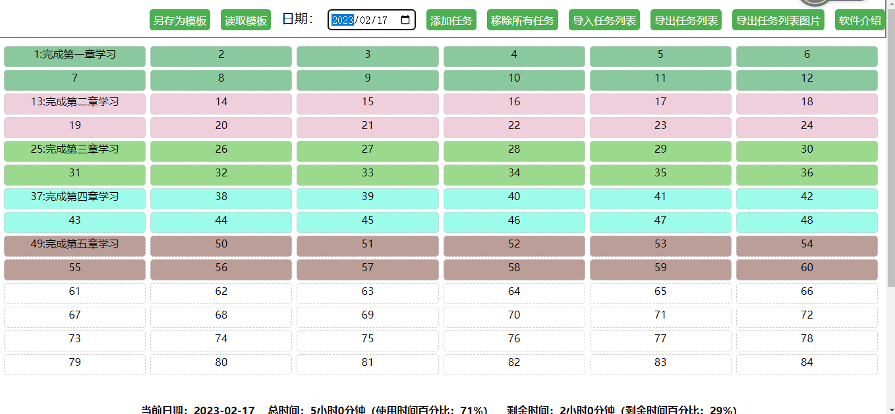

[简体中文](README.md)
# Title

Time Block Allocation Tool

## Description

This is a time block allocation tool that can help you arrange your time reasonably and improve efficiency.

## Installation

Single-page file, no installation required.

## Usage

## Function introduction

- Enter the group, task name, time and weight, select whether to calculate the time, and click the "Add Task" button.
- You can view the added tasks in the task list, and you can also remove a task or all tasks.
- You can view the total time, remaining time, and the percentage of time used and remaining time.
- You can view the time block chart to understand the distribution of used and remaining time.
- The added tasks can dynamically adjust whether to calculate time.
- The task list can be sorted by task weight.
- You can import the task list and import the previously saved task list to the current date.
- You can export the task list and export the task list of the current date to the local.
- You can click the "Locate" button in the task list to automatically jump to the corresponding task in the time block chart.
- You can click on a time block in the time block chart to automatically jump to the corresponding task in the task list.

## Contribution
kucece

## License
None
