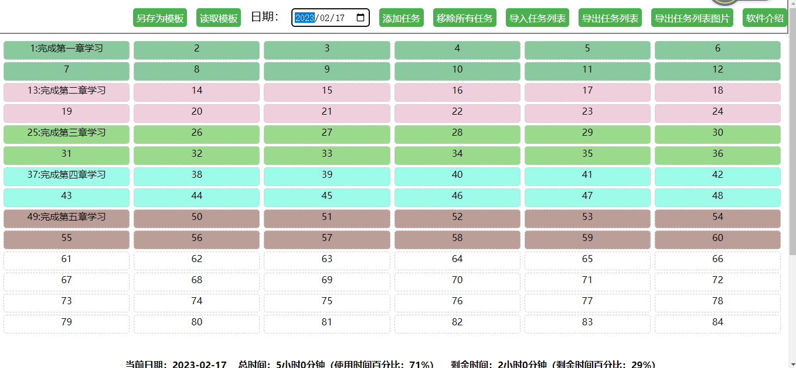

[English](README-EN.md)

# 标题

时间块分配工具

## 描述

这是一个时间块分配工具，可以帮助你合理安排时间，提高效率。

## 安装

单一网页文件，无需安装。

## 用法

## 功能介绍

- 输入组别、任务名称、时间和权重，选择是否计算时间，点击“添加任务”按钮。
- 可以在任务列表中查看已添加的任务，也可以移除某个任务或全部任务。
- 可以查看总时间、剩余时间和使用时间百分比、剩余时间百分比。
- 可以查看时间块图表，了解已用时间和剩余时间的分布情况。
- 已添加的任务可以动态调整是否计算时间。
- 任务列表可以按照任务权重排序。
- 可以导入任务列表，将之前保存的任务列表导入到当前日期。
- 可以导出任务列表，将当前日期的任务列表导出到本地。
- 可以在任务列表中点击“定位”按钮，自动跳转到时间块图表中对应的任务。
- 可以在时间块图表中点击某个时间块，自动跳转到任务列表中对应的任务。
- 可以另存为模板，将当前日期的任务列表保存为模板。
- 可以读取模板，将之前保存的模板读取到当前日期。
- 可以导出任务列表图片，将当前日期的任务列表导出为图片。
- 可以查看软件介绍，了解更多使用方法。

## 贡献
kucece

## 许可证
无
